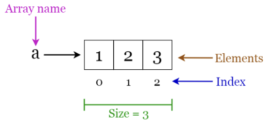
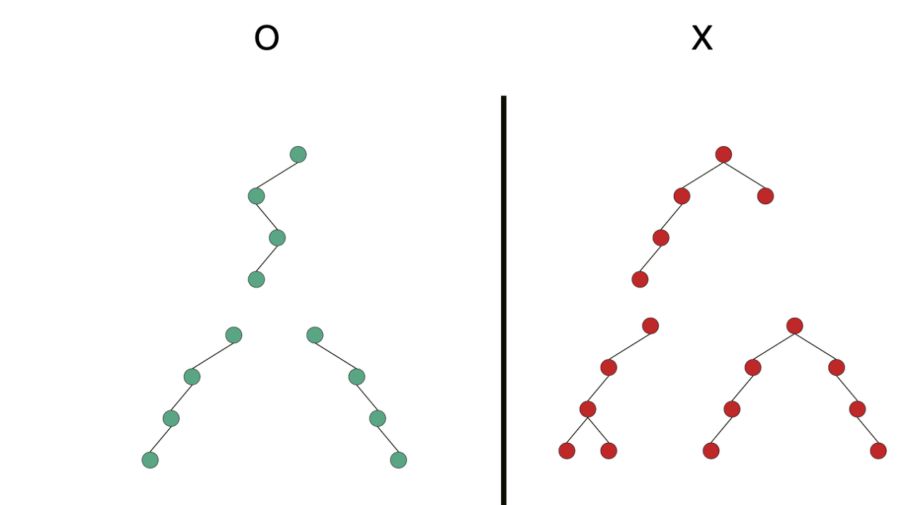

# Data Structure
---
## Index
### [1. Array](#1-array)
### [2. List](#2-list)
### [3. Sort](#3-sort)
### [4. Stack](#4-stack)
### [5. Queue](#5-queue)
### [6. Tree](#6-tree)
### [7. BST](#7-bst)
### [8. AVL](#8-avl)
### [9. Heap](#9-heap)
### [10. Graph](#10-graph)
---

## 1. Array
- 유사한 데이터 여러 개를 효율적으로 관리하기 위해 탄생한 자료구조
  - 학생 20명의 점수를 관리할 때, 각 학생들의 점수를 따로따로 관리하기보단, 하나의 파일첩을 만들어 한꺼번에 관리한다는 개념으로 생각하면 됨.
- 일반적으로 하나의 Array에는 하나의 자료형만 사용 가능
  - 포인터 개념으로 접근하면 보다 쉽게 이해 가능
- 리스트와 함께 다른 자료구조를 구성하는데 활용되는 경우가 많음

<center>

</center>

### 1.1. 특징
- 각 데이터가 메모리 주소로 인덱싱이 됨. 즉, N번째와 N+1번쩨 요소는 물리적으로 붙어있음
- 배열의 크기가 커질수록 요구하는 메모리 블록의 크기는 커짐 / 메모리를 비효율적으로 활용
- 대부분의 요소가 뭉쳐있으므로 각 요소에 대한 접근은 상대적으로 빠름.
#### Access
- N번째 요소를 참조할때, 배열의 첫번째 주소에서 N만큼 더한 값을 이동하는 방식으로 수행
  - 시간복잡도: O(1)

        ```Text
        자료형: Char / 배열 이름: arr

        5번째 요소에 접근

        0x20| '0' | <--- arr        1. arr의 첫번째 인덱스에 접근
        0x21| '1' |                 2. arr의 5번째 요소가 저장된 메모리에 바로 이동 
        0x22| '2' |
        0x23| '3' |
        0x24| '4' | <---바로 접근 가능!
        0x25| '5' |
        0x26| '6' |
        0x27| '7' |
        0x28| '8' |
        0x29| '9' |
        0x2A| 'A' |
        ```

#### Search
- 특정 값을 탐색하는 작업의 경우, 배열 내 모든 메모리를 탐색해야 함.
  - 시간복잡도: O(n)

    ```Text
    자료형: Char / 배열 이름: arr

    'A' 탐색

    0x20| '0' | <--- arr        1. arr의 첫번째 인덱스에 접근
    0x21| '1' | <--- 1번째 탐색   2. 원하는 값이 아닐 경우 다음 요소로 이동 후 확인 
    0x22| '2' | <--- 2번째 탐색   3. 이를 원하는 값이 나올때까지 반복
    0x23| '3' | <--- ...
    0x24| '4' |
    0x25| '5' |
    0x26| '6' |
    0x27| '7' |
    0x28| '8' |
    0x29| '9' |
    0x2A| 'A' | <--- 나올때까지 반복
    ```

#### Append
- 마지막에 요소를 추가하는 작업의 경우, 마지막에 메모리를 추가해주면 됨
  - 시간복잡도: O(n) / ??

    ```Text
    자료형: Char / 배열 이름: arr

    마지막에 A 추가

    0x20| '0' | <--- arr        1. arr의 마지막 인덱스에 접근
    0x21| '1' |                 2. 다음 메모리가 사용중이지 않을 경우 B 추가
    0x22| '2' |                 3. 사용중일 경우 전체 메모리 해제 후 다른 영역에
    0x23| '3' |                     벡터 재생성
    0x24| '4' | 
    0x25| '5' |
    0x26| '6' |
    0x27| '7' |
    0x28| '8' |
    0x29| '9' |
    0x2A| 'A' |
    ```
    
#### Insert
- 중간에 요소를 추가하는 작업의 경우, 추가하는 인덱스 이후의 모든 요소들의 물리적인 위치를 바꿔줘야함.
  - O(n)

    ```Text
    자료형: Char / 배열 이름: arr

    2번째 인덱스에 'C' 추가

    1. arr의 첫번째 인덱스에 접근
    2. 3번째 요소 이후의 요소들을 모두 1칸씩 뒤로 이동
    3. 빈 공간이 생긴 2번째 요소에 값을 대입

    0x20| '0' | <--- arr  0x20| '0' |           0x20| '0' |
    0x21| '1' |           0x21| '1' |           0x21| '1' |
    0x22| '2' |           0x22| '2' |           0x22| 'C' |
    0x23| '3' |           0x23| '2' |           0x23| '2' |
    0x24| '4' |           0x24| '3' |           0x24| '3' |
    0x25| '5' |           0x25| '4' |           0x25| '4' |
    0x26| '6' |           0x26| '5' |           0x26| '5' |
    0x27| '7' |           0x27| '6' |           0x27| '6' |
    0x28| '8' |           0x28| '7' |           0x28| '7' |
    0x29| '9' |           0x29| '8' |           0x29| '8' |
    0x2A| 'A' |           0x2A| '9' |           0x2A| '9' |
    0x2B|Empty|           0x2B| 'A' |           0x2B| 'A' |
    ```

#### Delete
- 요소를 삭제하는 작업의 경우, 삭제하는 인덱스 이후의 모든 요소들의 물리적인 위치를 바꿔줘야 함.
  - 시간복잡도: O(n)

    ```Text
    자료형: Char / 배열 이름: arr

    0번째 인덱스에 삭제

    1. arr의 첫번째 인덱스에 접근
    2. 0번째 요소 이후의 요소들을 모두 앞으로 1칸씩 이동

    0x20| '0' | <--- arr                        0x20| '1' |
    0x21| '1' |                                 0x21| '2' |
    0x22| '2' |                                 0x22| '3' |
    0x23| '3' |                                 0x23| '4' |
    0x24| '4' |                                 0x24| '5' |
    0x25| '5' |                                 0x25| '6' |
    0x26| '6' |                                 0x26| '7' |
    0x27| '7' |                                 0x27| '8' |
    0x28| '8' |                                 0x28| '9' |
    0x29| '9' |                                 0x29| 'A' |
    0x2A| 'A' |                                 0x2A|Empty|
    ```

### 1.2. 구현
- Python에선 리스트로 통일
- C++
    ```cpp
    #include<vector>
    #include<algorithm>
     // int 자리엔 자료형을 쓰면 됨
    vector<int> v;
    
    // append: 마지막에 요소 추가
    vector.push_end(1);
    vector.push_end(2);
    vector.push_end(3);

    // insert: 중간에 요소 삽입
    // v.begin()  == v[0]
    // v.begin() + 1 = v[1]
    v.insert(v.begin() + 1, 44);
    v.insert(v.begin() + 1, 44);

    // delete
    v.erase(v.begin() + 2);

    // access
    int temp = v[0];

    // search
    auto result = find(v.begin(), v.end(), 44);
    if(result != v.end()){
        cout << "값 44는" << (result - v.begin) << 위치에 있습니다.<< endl;
    }
    ```

### 1.3. Example
- [vector.cpp](./Examples/1.%20Array/cpp/vector.cpp): 사용자의 입력을 받아 기본적인 벡터를 제어하는 예제

---

## 2. List
- 배열과 마찬가지로 유사한 자료들을 한꺼번에 관리하기 위해 만들어짐
- 다만 배열은 메모리 블록이 필요한 것을 고려해, 메모리를 효율적으로 활용할 수 있는 구조를 고안
- 배열과 함께 다른 자료구조를 구성하는 기본 구조로 활용

<center>

</center>

### 2.1. 특징
- 노드(Node/Vertex)와 간선(Edge)의 개념을 도입
  - 노드: 실제 정보와 간선에 대한 정보를 저장
    - 실제 정보: 5,7 등 저장할 데이터
    - 간선 정보: 다음 노드의 포인터 주소
  - 간선: 노드와 노드를 연결하는 연결선
- N+1번쨰 노드에 접근하기 위해선 N번쨰 노드에서 N+1번째 노드의 포인터(간선)을 찾아야함.
- 메모리에 저장하는 데이터의 총량은 상대적으로 많으나, 각 노드가 물리적으로 연결된 상태일 필요가 없으므로 메모리를 보다 효율적으로 활용 가능함.
- 다만 각 요소에 대해 접근하기 위해선 포인터를 타고 이동하는 과정을 반복해야하므로 요소에 대한 접근은 느린 편임.

#### Access
- N번째 요소를 참조할때, 간선을 통해 N번만큼 이동한 후 노드의 데이터를 참조
  - 시간복잡도: O(n)

        ```Text
        3번째 요소에 접근

        key : 0x20|  -  | <--- Head     1. Head에 접근
        next: 0x21| 0x25|               2. next를 통해 4회 이동

        key : 0x25| '1' | <--- 1번째 이동
        next: 0x26| 0x32|

        key : 0x32| '2' | <--- 2번째 이동
        next: 0x33| 0xA2|

        key : 0xA2| '3' | <--- 3번째 이동
        next: 0xA3| 0xF5|

        key : 0xF5| '4' | <--- *4번째 이동*
        next: 0xF6| 0xD1|

        key : 0xD1| '5' |
        next: 0xD2| 0x25|
        ```

#### Search
- 특정 값을 탐색하는 작업의 경우, 리스트 내 모든 메모리를 탐색해야 함.
  - 시간복잡도: O(n)

    ```Text
    key: '5'

    key : 0x20|  -  | <--- Head     1. Head에 접근
    next: 0x21| 0x25|               2. 탐색중인 값과 일치하는 값이 나올때까지 
                                       이동하며 값을 비교
    key : 0x25| '1' | <--- 1번째 비교
    next: 0x26| 0x32|

    key : 0x32| '2' | <--- 2번째 비교
    next: 0x33| 0xA2|

    key : 0xA2| '3' | <--- ...
    next: 0xA3| 0xF5|

    key : 0xF5| '4' |
    next: 0xF6| 0xD1|

    key : 0xD1| '5' | <--- 일치하는 값 확인 후 반환
    next: 0xD2| 0x00|
    ```

#### Append
- 마지막에 요소를 추가하는 작업의 경우, 마지막에 메모리를 추가해주면 됨
  - 시간복잡도: O(1)

    ```Text
    'A' 추가

    key : 0x20|  -  | <--- Head     1. 추가할 노드 생성
    next: 0x21| 0x25|               2. 마지막 요소 탐색
                                    3. 마지막 요소의 next를 새로 생성한 노드로 변경
    key : 0x25| '1' |               
    next: 0x26| 0x32|

    key : 0x32| '2' |               
    next: 0x33| 0xA2|               

    key : 0xA2| '3' | 
    next: 0xA3| 0xF5|

    key : 0xF5| '4' |
    next: 0xF6| 0xD1|

    key : 0xD1| '5' |                   key : 0xF8| 'A' |
    next: 0xD2| 0x00| ---> | 0xF8|      next: 0xF9| 0x00|
    ```
    
#### Insert
- 중간에 요소를 추가하는 작업의 경우, 추가하는 인덱스 이후의 모든 요소들의 물리적인 위치를 바꿔줘야함.
  - O(1)

    ```Text
    '1' 다음 'A' 추가

    key : 0x20|  -  | <--- Head     1. 추가할 노드 생성
    next: 0x21| 0x25|               2. 1번째 요소 탐색
                                    1. 추가할 노드의 next에 1번째 요소의 next 대입
    key : 0x25| '1' |               4. 1번째 요소 next의 추가할 노드의 포인터 대입
    next: 0x26| 0x32| ---> | 0xF8|

    key : 0x32| '2' |               key : 0xF8| 'A' |
    next: 0x33| 0xA2|               next: 0xF9| 0x32|

    key : 0xA2| '3' | 
    next: 0xA3| 0xF5|

    key : 0xF5| '4' |
    next: 0xF6| 0xD1|

    key : 0xD1| '5' |
    next: 0xD2| 0x00|
    ```

#### Delete
- 삭제할 노드의 next를 삭제할 노드 바로 이전 노드의 next에 대입
  - 시간복잡도: O(1)

    ```Text
    '4' 삭제

    key : 0x20|  -  | <--- Head     1. 삭제할 노드를 탐색
    next: 0x21| 0x25|               2. 삭제할 노드의 이전 노드의 next에
                                       삭제할 노드의 next 대입
    key : 0x25| '1' |               
    next: 0x26| 0x32| 

    key : 0x32| '2' |               
    next: 0x33| 0xA2|               

    key : 0xA2| '3' | 
    next: 0xA3| 0xF5| ---> | 0xD1|

    key : 0xF5| '4' |
    next: 0xF6| 0xD1| 

    key : 0xD1| '5' |
    next: 0xD2| 0x00|
    ```

### 2.2. 구현
- python
    ```python
    lst = []

    # append
    lst.append(1)
    lst.append(2)
    lst.append(3)

    # insert
    lst.insert(0,4)
    lst.insert(1,5)
    lst.insert(2,6)

    # delete
    lst.pop()
    lst.pop(2)

    # access
    temp = lst[0]

    #search
    idx = lst.index(3)
    ```
- cpp
  - cpp에선 list보단 vector을 선호하므로 패쓰

### 2.3. Examples
- [list.cpp](./Examples/2.%20List/cpp/list.cpp): 클래스를 통해 리스트를 간단히 구현해본 예제


---

## 3. Sort

---

## 4. Stack
- 스택은 배열/리스트를 활용한 자료구조이다.
- 상자를 쌓듯, 차곡차곡 데이터를 쌓아 보관하다 특정 시점에서 데이터를 꺼내 활용하는 것을 목적으로 한다.
- 가장 마지막에 입력된 요소가 가장 먼저 빠져나오는 구조
- 스택은 결과적으로 비워지는 것을 목표로 하며, 스택이 완전히 비워지는 것은 곧 알고리즘 블록이 완료됐다는 의미이기도 하다.

<center>

</center>

### 4.1. 특징
- top: 스택의 최상단
- push / pop을 통해 요소를 추가 / 제거
  - push: 스택에 요소를 추가 / top += 1
  - pop: 스택에서 요소를 제거 / top -= 1

#### Push
- append와 유사하게 동작하나, top을 같이 변경
    
    ```Text
    push(8)        ->     push(9)        ->     push(A)

    0x28| '8' |<-- top    0x28| '8' |           0x28| '8' |                
    0x29|  -  |           0x29| '9' |<-- top    0x29| '9' |
    0x2A|  -  |           0x2A|  -  |           0x2A| 'A' |<-- top           
    ```

#### Pop
- delete할 필요 없이, top의 값을 하나 낮춰주면 해당 데이터는 없어진 데이털 처리됨
- 이후 append를 할 경우, 기존 데이터를 덮어쓰므로 굳이 delete를 해줄 이유 없음

    ```Text
    pop()          ->     pop()          ->     pop()

    0x28| '8' |           0x28| '8' |           0x28| '8' |<-- top                
    0x29| '9' |           0x29| '9' |<-- top    0x29| '9' |
    0x2A| 'A' |<-- top    0x2A| 'A' |           0x2A| 'A' |           
    ```

### 4.2. 구현
- 일반적으로 스택 알고리즘은 아래 구조를 하고 있음.

    ```text
    // 파라미터 초기화
    INIT
    while !stack_is_empty:
        var = pop()
        data_process(var)
        if push_condition:
            push()
    ```
    
### 4.3. Example
- [custom_stack.cpp](./Examples/3.%20Stack/cpp/custom_stack.cpp): 스택의 기본적인 기능을 구현한 클라스
- [braket_check.cpp](./Examples/3.%20Stack/cpp/braket_check.cpp): 브라켓({, [, (, ), ], })의 무결성 확인 알고리즘

---

### 5. Queue
- 스택과 동일하게 배열 / 리스트를 활용한 자료구조
- 스택과 대부분이 유사하나, 데이터가 들어온 순서대로 빠져나감

<center>

</center>

### 5.1. 특징
- 스택과 달리, 바닥이 0번 인덱스로 고정되어있지 않기 때문에 바닥과 천장 두 가지를 다 명시해줘야 함.
  - front: 큐의 첫번째 인덱스
  - rear: 큐의 마지막 인덱스 + 1
- 배열 기반 큐는 `배열의 크기 - 1`만큼의 요소를 가질 수 있음
  - 물론 리스트 기반 큐는 그딴거 없음 ㅋ;
    ```Text
    Empty Queue                     enqueue(0)

    0x28|  -  |                     0x28|  -  |                     
    0x29|  -  |<-- front / rear     0x29| '0' |<-- front     
    0x2A|  -  |                     0x2A|  -  |<-- rear            
    0x2B|  -  |                     0x2B|  -  |                     

    enqueue(1)                      enqueue(2)

    0x28|  -  |                     0x28|  -  |<-- rear                     
    0x29| '0' |<-- front            0x29| '0' |<-- front     
    0x2A| '1' |                     0x2A| '1' |                     
    0x2B|  -  |<-- rear             0x2B| '2' |                     
    
    enqueue(3) <-- front와 rear의 상태가 empty queue와 동일

    0x28| '3' |                     
    0x29| '0' |<-- front / rear     
    0x2A| '1' |                     
    0x2B| '2' |                     
    ```

- enqueue / dequeue을 통해 요소를 추가 / 제거
  - enqueue: 큐에 요소를 추가 / top += 1
  - dequeue: 큐에서 요소를 제거 / top -= 1

#### Enqueue
- 데이터를 추가하고 rear을 변경
- 만약 rear이 스택의 크기 이상이 될 경우, 나머지 연산을 활용
    
    ```Text
    enqueue(8)     ->            enqueue(9)     ->          enqueue(A)

    0x28|  -  |                  0x28|  -  |                0x28|  -  |<-- rear  
    0x29| '8' |<-- front         0x29| '8' |<-- front       0x29| '8' |<-- front
    0x2A|  -  |<-- rear          0x2A| '9' |                0x2A| '9' |
    0x2B|  -  |                  0x2B|  -  |<-- rear        0x2B| 'A' |
    ```

#### Dequeue
- 데이터를 뽑고 front를 변경
- 만약 front가 스택의 크기 이상이 될 경우, 나머지 연산을 활용
- 이후 enqueue를 할 경우, 기존 데이터를 덮어쓰므로 굳이 유효하지 않은 값으로 덮어쓸 필요 없음

    ```Text
    dequeue()     ->            dequeue()     ->          dequeue()

    0x28|  -  |<-- rear          0x28|  -  |<-- rear        0x28|  -  |<-- front/rear
    0x29| '8' |<-- front         0x29| '8' |                0x29| '8' |
    0x2A| '9' |                  0x2A| '9' |                0x2A| '9' |
    0x2B| 'A' |                  0x2B| 'A' |<-- front       0x2B| 'A' |  
    ```

### 5.2. 구현
- 일반적으로 큐 알고리즘은 스택 알고리즘과 동일한 구조를 하고 있음.

    ```text
    // 파라미터 초기화
    INIT
    while !queue_is_empty:
        var = dequeue()
        data_process(var)
        if enqueue_condition:
            enqueue()
    ```
### 5.3. Example
- [queue.cpp](./Examples/4.%20Queue/cpp/queue.cpp): 큐의 기본적인 기능을 구현한 클라스
- [queue_example.cpp](./Examples//4.%20Queue/cpp//queue_example.cpp): 큐를 활용한 문제 풀이
    ```
    // 하중을 50만큼 만큼 견딜 수 있는 다리가 있다. 
    // 모든 자동차는 그 다리를 건너기 위해 3분이 걸리고, 자동차는 앞의 자동차가 출발하고 1분 후 다리를 진입할 수 있다.
    // 각 자동차의 무게는 입력으로 주어진다.
    // 이때, 입력한 모든 자동차가 다리를 건너기 위해 필요한 시간을 계산해라.
    input[10] = {10, 10, 30, 50, 30, 10, 20, 20, 20}

    answer = 18(아닐 수 있음 ㅎ)
    ```

---

## 6. Tree
- 스택 / 큐는 데이터를 입력받은대로 처리하는 선형적 구조를 띈다.
- 이런 선형적 구조는 데이터의 탐색에 시간이 많이 소모된다는 단점이 있다.
  - 그렇다면 데이터의 추가 자체를 지정된 알고리즘을 스까서 해버리면 어떨까?
  - 데이터를 추가할 위치를 알고리즘을 통해 정해준다면, 탐색에 필요한 시간을 줄일 수 있지 않을까?
- 이렇게 나온게 트리임 ㅇㅇ;
- 어차피 AVL/Heap을 보기 위한 빌드업이니 간단히 보고 넘기도록 하자

<center>


</center>

<br/>

- 용어 정리
  - **루트 노드(Root Node)**: 부모가 없는 최상위 노드
  - **단말 노드(Leaf Node)**: 자식이 없는 최하위 노드
  - 내부 노드(Internal Node): !(루트노드 | 단말노드)
  - 간선(Edge): 노드를 연결하는 선
  - **깊이(Depth)**: 루트에서 어떤 노드에 도달하기 위해 필요한 간선의 수
  - 레벨(Level): 단말 노드에서 어떤 노드에 도달하기 위해 필요한 최대 간선의 수
  - **트리의 높이(height)**: 루트 노드에서 가장 멀리 떨어진 노드의 깊이

### 6.1. 특징
- 노드와 엣지 개념이 본격적으로 활용되기 시작하는 자료구조
  - 각 노드는 노드에 저장할 데이터와 자식 노드의 포인터(간선 정보)를 저장
    ```cpp
    class Node{
        int data = -1;
        Node *child[N] = {nullptr, nullptr, nullptr, ..., nullptr};
    };
    ```
- 적용 알고리즘 / 형태 등으로 다양하게 나뉘지만...이걸 해주는건 컴퓨터겠지 ㅇㅇ;
  1. 알고리즘
     - binary tree
       - 최대 두 개의 자식 노드를 가질 수 있는 트리

        <center>
        
        </center>

     - **binary search tree(BST)**
       - 이진 트리의 개량된 형태
       - 왼쪽 자식 노드는 현재 노드보다 더 작은 값을, 오른쪽 자식 노드는 현재 노드보다 더 큰 값을 저장
     
        <center>
        
        </center>

     - red-black tree 등등...
  2. 형태
     - Full Binary Tree
       - 모든 노드의 자식이 모두 있거나 모두 없는 이진 트리

        <center>
        
        </center>

     - **Complete Binary Tree**
       - 마지막 레벨를 제외하고 모든 노드의 자식이 모두 있거나 모두 없음
       - 마지막 레벨에선 왼쪽부터 차례대로 채워져있음

        <center>
        
        </center>

     - Skewed Binary Tree
       - 왼쪽 또는 오른쪽으로 편향된 트리

        <center>
        
        </center>

     - **Balanced Binary Tree**
       - 모든 노드의 왼쪽 / 오른쪽 서브 트리의 높이가 1이상 차이나지 않는 트리

        <center>
        
        </center>

#### 트리의 순회
- 트리의 모든 노드를 체계적인 방법으로 탐색하는 과정을 의미
  1. 전위 순회(preorder / DFS)
     - 부모노드 - 왼쪽 노드 - 오른쪽 노드 순서대로 방문
     - 트리를 복사거나 전위 표기법을 구하는데 주로 사용

        <center>
        
        </center>

  2. 중위 순회(inorder)
     - 왼쪽 노드 - 부모 노드 - 오른쪽 노드 순서대로 방문
     - 오름차순 / 내림차순으로 값을 가져올 때 주로 사용

        <center>
        
        </center>

  3. 후위 순회(postorder)
     - 왼쪽 노드 - 오른쪽 노드 - 부모 노드 순서대로 방문
     - 노드를 삭제할때 주로 사용

        <center>
        
        </center>

#### Search
- 알고리즘에 따라 약간의 차이는 있지만, 일반적으로 높이에 정비례함
- 보다 정확한건 BST의 탐색 참고

### 5.2. 구현
- bst를 제외한 트리는 코테에선 크게 사용 안함. 따라서 구현부와 example은 패스.
- python
  - 귀찮으니 그냥 라이브러리(anytree)를 쓰자...
- cpp
  - map/set 자료구조를 활용해 비슷하게 만들 순 있음

---

## 7. BST
- 이진 트리를 탐색에 최적화한 형태
- 어차피 AVL/Heap을 보기 위한 빌드업이니 간단히 보고 넘기도록 하자

### 7.1. 특징
- 왼쪽 자식 노드의 값은 반드시 부모 노드의 값보다 작아야 한다.
- 오른쪽 자식 노드의 값은 반드시 부모 노드의 값보다 커야 한다.

#### Search
- 찾으려는 값이 현재 노드의 값보다 작을 경우 왼쪽 자식 노드로 이동
- 찾으려는 값이 현재 노드의 값보다 클 경우 오른쪽 자식 노드로 이동
- 시간 복잡도: O(h) / h는 트리의 높이
  - 현재 이진 트리의 형태에 따라 시간 복잡도가 결정


    <center>
    
    </center>

#### Insert
- BST는 단말 노드만 추가 가능
- 탐색 후 원하는 값이 제 위치에 없을 경우, 그 위치에 새로운 노드를 생성 후 값을 대입

<center>

</center>

#### Delete
- 일단 삭제할 노드의 종류를 확인해야 함.
  1. 단말 노드
     - 얜 그냥 삭제하면 됨

        <center>
        
        </center>

  2. 하나의 자식 노드를 가질 경우
     - 삭제할 노드의 자식 노드를 삭제할 노드의 부모 노드에 연결

        <center>
        
        </center>

  3. 두개의 자식 노드를 가질 경우
     - 얜 좀 골때림 / 그냥 무지성 연결하면 이진 트리가 아니게 됨

        <center>
        
        
        </center>

    - 그래서 도달한 결론이 삭제할 값에 제일 가까운 놈들을 가져다 쓰자! 라는 결론
      - 삭제할 노드의 왼쪽 서브 트리 중 최대값 / 오른쪽 서브 트리 중 최소값을 찾아 삭제할 위치에 대입
      - 와! 문제 해결 

        <center>
        
        
        </center>

## 8. AVL
- 앞서 본 BST는 트리 자체의 높이가 중요한 역할을 한다.
- 따라서 노드의 왼쪽 서브 트리와 오른쪽 서브 트리의 높이 차이가 별로 나지 않는 상황(balanced binary tree)에서 최대 효율이 나옴
  - Skew Tree의 탐색: O(h) = O(n)
  - balanced binary tree의 탐색: O(h) = O(log n)
- 그럼 노드의 삽입 / 삭제로 인해 트리의 균형이 깨지면 회전을 통해 다시 노드의 위치를 재정렬해볼까?
- 간단히 말해, bst 트리에서 노드의 삽입 / 삭제 이후 트리의 균형을 확인하고, 이를 재정렬하는게 AVL 트리라 생각하면 됨.
- 얘도 코테에 나오긴 쉽지 않음. 그냥 알응 / 자료구조 하는 김에 같이 하는거지.
- 얘보다 힙이 중요함 ㅇㅇ;

### 8.1. 특징
- Insert와 Delete는 BST와 동일하게 수행. 다만 고려할 요소가 하나 더 추가됨.
- Balance Factor(BF): 왼쪽 서브트리의 높이 - 오른쪽 서브트리의 높이
- AVL 트리는 BF가 -1과 1 사이에 있는 것이 정상적임.
  - 그 이외의 값을 가질 경우, 균형이 맞지 않는(unbalanced) 상태임
  - 이 경우, 회전을 통해 트리를 균형이 잡힌 상태로 변환

    <center>
    
    </center>

- 회전은 상황에 따라 총 네 가지 방식으로 분류

#### Rotation - LL
- bf가 범위 이상인 노드(z) 기준으로 왼쪽 자식 노드가 두 개(x,y) 있을 때 사용
  - y의 오른쪽 서브 트리(T2)는 모두 z보다 작은 값을 가짐. 즉, z의 왼쪽 서브 트리로 붙일 수 있음
  - 그럼 y를 부모 노드로 올리고 x,z를 자식 노드로 내려버려도 상관 없음

    <center>
    
    </center>

#### Rotation - RR
- bf가 범위 이상인 노드(z) 기준으로 오른쪽 자식 노드가 두 개(x,y) 있을 때 사용
  - y의 오른쪽 서브 트리(T2)는 모두 z보다 큰 값을 가짐. 즉, z의 오른쪽 서브 트리로 붙일 수 있음
  - 그럼 y를 부모 노드로 올리고 x,z를 자식 노드로 내려버려도 상관 없음

    <center>
    
    </center>

#### Rotation - LR
- bf가 범위 이상인 노드(z) 기준으로 왼쪽 자식노드 하나(y)와 오른쪽 자식 노드 하나(x)가 순서대로 있을 때 사용
  - 노드 x의 왼쪽 서브 트리(T2)는 모두 노드 y보다 크므로 노드 y의 오른쪽 서브 트리로 들어갈 수 있음
  - 그럼 반대로 x를 y의 부모 노드 형태로 변환 가능
  - 그 후 RR 회전을 1회 더 수행

    <center>
    
    </center>

#### Rotation - RL
- bf가 범위 이상인 노드(z) 기준으로 오른쪽 자식노드 하나(y)와 왼쪽 자식 노드 하나(x)가 순서대로 있을 때 사용
  - 노드 x의 오른쪽 서브 트리(T3)는 모두 노드 y보다 작으므로 노드 y의 오른쪽 서브 트리로 들어갈 수 있음
  - 그럼 반대로 x를 y의 부모 노드 형태로 변환 가능
  - 그 후 LL 회전을 1회 더 수행

    <center>
    
    </center>
---
## 9. Heap
- 우선순위 큐를 구현하기 위해 만들어진 자료구조
- 완전 이진 트리의 일종
- 클래스의 멤버 변수 등을 키 값을 기준으로 최대값과 최소값을 빠르게 찾아낼 수 있음
- 중복된 값을 허용한다

<center>

</center>

### 9.1. 특징
- 부모 노드의 키 값은 자식 노드보다 항상 크거나 같다.
  - 최소 힙일 경우 항상 작거나 같다.
- 일반적으로 배열을 통해 구현한다.

<center>

</center>

```text
왼쪽 자식: (부모 Index) * 2
오른쪽 자식: (부모 Index) * 2 + 1
부모: (자식 Index) / 2
```

#### Insert
<center>

</center>

#### Delete
<center>

</center>

### 9.2. 구현
- cpp: algorithm 헤더의 make_heap / push_heap / pop_heap 활용
    ```cpp
    #include<algorithm>
    using namespace std;

    vector<int> v( vector<int> {1,6,5,2,3,8,4,9,7 });
    // heap 알고리즘에 따라 v의 인덱스를 재정렬
    make_heap(v.begin(), v.end());

    // push_heap은 요소 추가 후 호출
    // 요소 추가되는 과정에서 생기는 시간 소모를 최소화하기 위해
    // 그러는듯?
    v.push_back(15);
    push_heap(v.begin(), v.end());

    // pop_heap 호출 시 우선순위가 가장 높은 값을 v[0]에 배치
    // 그 외의 요소들은 v.begin() + 1 부터 v.end() 까지 재배치
    pop_heap(v.begin(), v.end());
    v.pop_back();

    # 최소값(Maxheap의 경우 최대값)을 pop하지 않고 얻고 싶을 때
    min = v[0]
    ```

- python: heapq 모듈 활용
    ```python
    from heapq import heappush, heappop, heapify

    heap = [1,6,5,2,3,8,4,9,7]

    # 기존 배열을 힙 형태로 변환
    heapif(heap)

    # push
    heappush(15)
    heappush(2)
    heappush(5)

    # pop 후 heap 재배열
    print(heappop(heap))

    # 최소값(Maxheap의 경우 최대값)을 pop하지 않고 얻고 싶을 때
    min = heap[0]

    # 최대값의 경우, 순서대로 정렬되지 않으므로 그냥 sort 함수를 활용하자
    ```

### 9.3. Example
- [heap.cpp](./Examples/9.%20Heap/cpp/heap.cpp): 간단한 힙 기능 구현
- [example.py](./Examples//9.%20Heap/python/example.py): [프로그래머스 문제](https://school.programmers.co.kr/learn/courses/30/lessons/42628) 풀이

## 10. Graph
- 원소 간의 관계를 표현한 자료구조
- 트리와 달리 간선 자체에도 가중치가 붙음.
  - 노드를 각 지역, 간선을 각 지역까지 연결된 도로라 가정하고 지도를 생각하면 보다 이해하기 편함.
  - 각 도로의 거리와 이동할 수 있는 방향이 다르듯, 모든 간선은 서로 다른 가중치와 방향성을 가질 수 있음.
- 트리도 그래프의 일종임


<center>

</center>

- 노드: 정점(Vertex)라고도 하며, 각 노드에는 데이터가 저장된다
- 간선: 두 노드를 연결하는 선
- 인접 노드: 간선에 의해 작접 연결된 노드
- 사이클: 노드 / 간선이 폐곡선을 구성

### 10.1. 특징
- 사실 특징보단 구현 과정과 활용한 알고리즘이 중요한 자료구조
  - 구현 과정: DFS / BFS
  - 활용: 다익스트라 / A* 등등
- 형태에 따라 다양한 종류로 분류
  - 무방향 그래프 / 방향 그래프: 간선의 방향성의 유무

    <center>
    
    
    </center>

  - 완전 그래프: 노드가 다른 모든 노드와 연결되어 최대 간선 수를 갖는 그래프

    <center>
    
    </center>

  - 부분 그래프: 기존 그래프에서 일부 노드이나 간선을 제외해 만든 그래프

    <center>
    
    </center>

  - 가중그래프: 간선에 가중치가 부여된 그래프

    <center>
    
    </center>
    
  - 유향 비순환 그래프: 사이클이 존재하지 않는 방향 그래프
    - 트리가 얘임 ㅇㅇ

    <center>
    
    </center>

  - 연결 그래프 / 단절 그래프: 서로 이동할 수 없는 노드의 유무

    <center>
    
    
    </center>

### 10.2. 구현

<center>

</center>

1. **관계 파악**
   - 위의 그래프에서 각각 노드는 아래와 같이 이동할 수 있음
     - 무방향 그래프
       - 노드 A: 노드 B(1) / 노드 D(3)
       - 노드 B: 노드 A(1) / 노드 C(8) / 노드 D(2)
       - 노드 C: 노드 B(8) / 노드 D(5)
       - 노드 D: 노드 A(3) / 노드 B(2) / 노드 C(5)
     - 방향 그래프
       - 노드 A: 노드 B(5) / 노드 D(9)
       - 노드 B: 노드 D(8) / 노드 C(2)
       - 노드 C: 노드 D(7)
       - 노드 D: - 
   - 여기서 활용하는 알고리즘이 완전 탐색 알고리즘(**DFS/BFS**)
     - BFS와 DFS의 결과는 동일하나, 각 노드의 탐색 순서가 서로 다름

2. 관계를 배열/리스트 형태로 가공
   - A -> B 노드로 이동 가능할 경우, 이동에 필요한 가중치를 저장
   - A -> B 노드로 이동 불가능할 경우, `-1` 혹은 매우 높은 가중치(`INT_MAX`)를 할당
   - 배열 그래프
     - 무방향 그래프
     
       ||A|B|C|D|
       |:--:|:--:|:--:|:--:|:--:|
       |**A**|0|1|-1|3|
       |**B**|1|0|8|2|
       |**C**|-1|8|0|5|
       |**D**|3|2|5|0|
     
     - 방향 그래프

       ||A|B|C|D|
       |:--:|:--:|:--:|:--:|:--:|
       |**A**|0|5|-1|9|
       |**B**|-1|0|2|8|
       |**C**|-1|-1|0|7|
       |**D**|-1|-1|-1|0|
   - 리스트 그래프
     - 무방향 그래프

      ```text
      [A Header] -> [LinkNode: B / Value: 1] -> [LinkNode: D / Value: 3]
      [B Header] -> [LinkNode: A / Value: 1] -> [LinkNode: C / Value: 8] -> [LinkNode: D / Value: 2]
      [C Header] -> [LinkNode: B / Value: 8] -> [LinkNode: D / Value: 5]
      [D Header] -> [LinkNode: A / Value: 3] -> [LinkNode: C / Value: 2] -> [LinkNode: D / Value: 5]
      ```

     - 방향 그래프

      ```text
      [A Header] -> [LinkNode: B / Value: 5] -> [LinkNode: D / Value: 9]
      [B Header] -> [LinkNode: C / Value: 2] -> [LinkNode: D / Value: 8]
      [C Header] -> [LinkNode: D / Value: 7]
      [D Header]
      ```

#### DFS 기반 그래프 탐색

##### !!탐색 알고리즘은 사람마다 차이 있으니 이런 느낌이구나 정도만 이해할것!!

1. 시작 노드 확인
    
    ```
    Visited: -
    Searched: A 
    Stack: A

    Graph
    -
    ```

1. 시작 노드 방문
   - 방문 노드와 연결된 노드 확인 / 그래프에 간선 정보 추가
   - 연결된 노드 중 **탐색되지 않은 노드**(!Searched)를 스택에 추가
  
    ```
    Visited: A
    Searched: A B D
    Stack: B D

    Graph
    A: B/1 D/3
    ```

2. 다음 노드 방문
  
    ```
    Visited: A D
    Searched: A B C D
    Stack: B C

    Graph
    A: B/1 D/3
    D: A/3 B/2 C/5
    ```

3. 다음 노드 방문
  
    ```
    Visited: A C D
    Searched: A B C D
    Stack: B

    Graph
    A: B/1 D/3
    C: C/8 D/5
    D: A/3 B/2 C/5
    ```

4. 다음 노드 방문
  
    ```
    Visited: A B C D
    Searched: A B C D
    Stack: -

    Graph
    A: B/1 D/3
    B: A/1 C/8 D/2
    C: B/8 D/5
    D: A/3 B/2 C/5
    ```

5. 스택이 비었으므로 탐색 종료
  
    ```
    Visited: A B C D
    Searched: A B C D
    Stack: -

    Graph
    A: B/1 D/3
    B: A/1 C/8 D/2
    C: B/8 D/5
    D: A/3 B/2 C/5
    ```

#### BFS 기반 그래프 탐색


##### !!탐색 알고리즘은 사람마다 차이 있으니 이런 느낌이구나 정도만 이해할것!!

1. 시작 노드 확인
    
    ```
    Visited: -
    Searched: A 
    Queue: A

    Graph
    -
    ```

1. 시작 노드 방문
   - 방문 노드와 연결된 노드 확인 / 그래프에 간선 정보 추가
   - 연결된 노드 중 **탐색되지 않은 노드**(!Searched)를 스택에 추가
  
    ```
    Visited: A
    Searched: A B D
    Queue: B D

    Graph
    A: B/1 D/3
    ```

2. 다음 노드 방문
  
    ```
    Visited: A B
    Searched: A B C D
    Queue: D C

    Graph
    A: B/1 D/3
    B: A/1 C/8 D/2
    ```

3. 다음 노드 방문
  
    ```
    Visited: A B D
    Searched: A B C D
    Queue: C

    Graph
    A: B/1 D/3
    B: A/1 C/8 D/2
    D: A/3 B/2 C/5
    ```

4. 다음 노드 방문
  
    ```
    Visited: A B C D
    Searched: A B C D
    Queue: -

    Graph
    A: B/1 D/3
    B: A/1 C/8 D/2
    C: B/8 D/5
    D: A/3 B/2 C/5
    ```

5. 스택이 비었으므로 탐색 종료
  
    ```
    Visited: A B C D
    Queue: -

    Graph
    A: B/1 D/3
    B: A/1 C/8 D/2
    C: B/8 D/5
    D: A/3 B/2 C/5
    ```

### 10.3. Example
- [dfs.py](./Examples/10.%20Graph/python/dfs.py): dfs인데 좀 많이 쓰까먹은 버전
- [bfs.py](./Examples/10.%20Graph/python/bfs.py): bfs인데 좀 많이 쓰까먹은 버전
- [outsourcing](./Examples/10.%20Graph/python/outsourcing/main.py): 이전에 외주로 해준 프로젝트
  - flask 서버를 활용해 네비게이션을 만들자!
    - 웹 크롤링을 통해 JC의 정보를 얻어올 것!
    - 원하는 JC 두개를 선택해 두 JC를 이동할 수 있는 최단 거리를 찾아올 것!
    - 그냥 대충 requirements 항목 설치하고 돌려보면 뭔 뜻인지 알듯